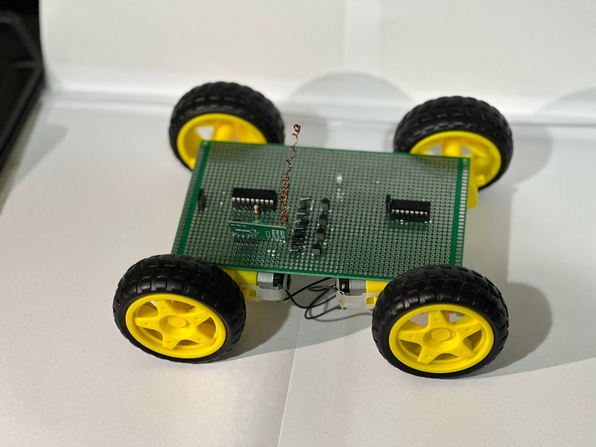
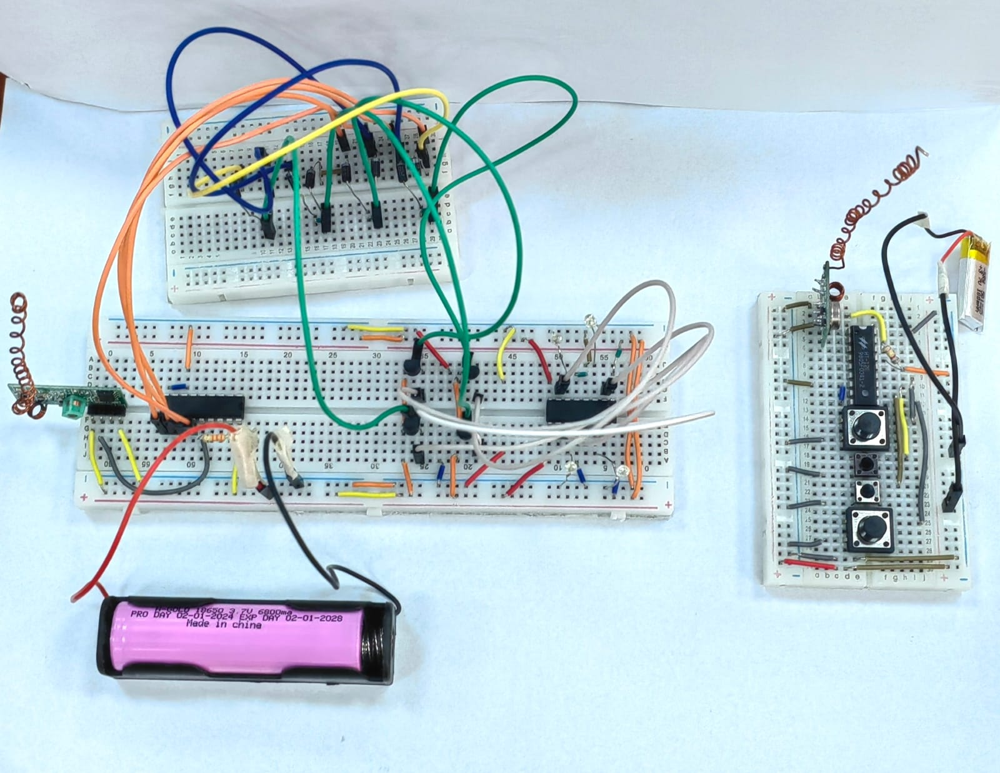
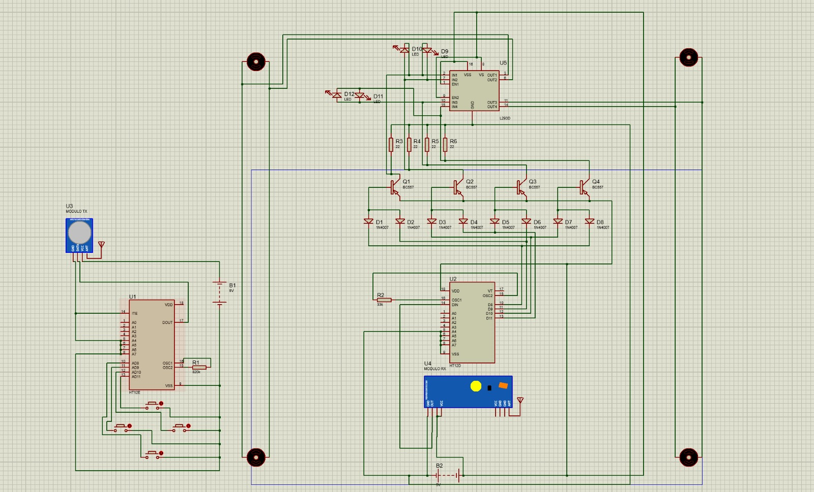
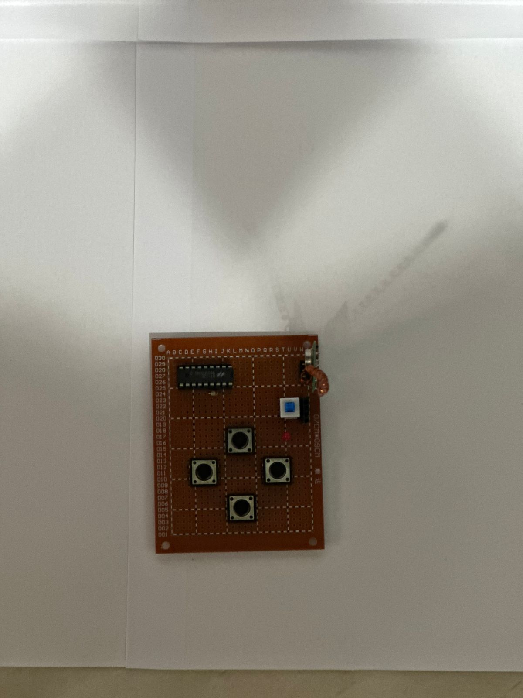

# RC Car — RF Remote-Controlled Car (no microcontroller)

This is a four-wheel remote-controlled car and its handheld remote, built for a university
electronics project. The point of interest is that there is no microcontroller anywhere in
it and no code to flash: the whole thing runs on an encoder/decoder pair, an RF link, and a
small array of diodes and transistors wired up as logic gates. Pressing a button on the
remote turns a motor on the car, and everything in between is done in hardware.

I built it with two teammates. We designed and simulated the circuit in Proteus first, then
prototyped it on breadboards, then soldered the final remote and car onto perfboard.



The car is a four-wheel-drive perfboard chassis. The two dark ICs are the HT-12D decoder and
the L293D motor driver; the row of small parts between them is the diode/transistor logic;
the coil of copper wire is the antenna for the RF receiver underneath.

## How it works

The remote and the car are two separate circuits joined only by a 433 MHz radio link.

**Remote.** Four tactile push buttons stand for forward, back, left and right. Each button
pulls one data input of an **HT-12E** encoder. The HT-12E serialises those four data bits,
together with an 8-bit address, into a single bitstream on its output pin, and that pin feeds
an **STX882** ASK transmitter module with a hand-wound coil antenna.

**Car.** An **SRX882** receiver module picks the signal up and hands the recovered bitstream
to an **HT-12D** decoder. When the address in the frame matches the decoder's own address
pins, the HT-12D raises its valid-transmission (VT) pin and drives its four data outputs to
match the buttons that were pressed on the remote.

Those four decoder outputs don't drive the motors directly. They first pass through a small
logic network: each pair of 1N4007 diodes forms an AND gate, and each BC557 PNP transistor
after it acts as an inverter, so every channel is effectively a NAND of two decoder outputs.
The NAND outputs feed the input pins of an **L293D** dual H-bridge, which is what actually
drives the four DC motors forward or backward. The car steers like a tank: to turn, the two
sides are driven in opposite directions rather than with a steering servo.



## Components

| Part | Where | Purpose |
|------|-------|---------|
| 4 × tactile push buttons | Remote | Forward / back / left / right commands |
| HT-12E encoder (18-pin DIP) | Remote | Encodes the 4 button lines + address into a serial frame |
| STX882 ASK module (433 MHz) | Remote | Wireless transmitter, hand-wound coil antenna |
| 820 kΩ resistor | Remote | Sets the HT-12E oscillator frequency |
| SRX882 ASK module (433 MHz) | Car | Wireless receiver, hand-wound coil antenna |
| HT-12D decoder (18-pin DIP) | Car | Recovers the 4 data lines; VT pin flags a valid frame |
| 33 kΩ resistor | Car | Sets the HT-12D oscillator (about 1/50 of the encoder's) |
| 8 × 1N4007 diodes | Car | Paired into diode-AND gates on the decoder outputs |
| 4 × BC557 PNP transistors | Car | Inverters (NOT gates) after each AND, with 10 kΩ base resistors |
| L293D dual H-bridge | Car | Drives the motors in both directions |
| 4 × DC gear motors + wheels | Car | Four-wheel-drive chassis |
| 4 × LEDs | Car | Direction indicators |
| 22 Ω resistors | Car | Series limiting on the driver lines |
| 3.7 V Li-ion / LiPo cells | Both | Power (a single 18650 on the car, a small LiPo on the remote) |

## Design notes

- **No microcontroller, no firmware.** Every decision the car makes is made by the
  encoder/decoder pair and a handful of gates built from discrete diodes and transistors.
  There is nothing to compile or flash, which is why this repo has a Proteus project and
  photos but no source code.
- **Diode-AND plus transistor-NOT.** Rather than buy logic-gate ICs, we made the gates from
  parts we had: two diodes pointed into a common node give a wired-AND, and a PNP transistor
  pulling to its collector rail inverts it. The four cases of that gate are captured in the
  logic screenshots in `media/`.
- **Address pins are the pairing.** The remote and car "pair" purely through the HT-12E and
  HT-12D address pins (A0–A7). They must be set the same on both boards or the decoder
  ignores the frames. This is done in hardware, not in software.
- **Oscillator ratio.** The HT-12D's oscillator resistor is roughly 1/50 of the HT-12E's
  (33 kΩ against 820 kΩ), which is the ratio the parts want for the decoder to lock onto the
  encoder's bitrate.
- **Tank steering.** With one H-bridge channel per side, a turn is just the two sides running
  opposite ways; there is no separate steering mechanism.
- **Antennas are hand-wound.** Both RF modules use a coil of copper wire soldered to the
  antenna pin to extend range, visible in the build photos.

## Proteus simulation

`rc-car.pdsprj` is the Proteus 8 project for the whole system — the encoder, decoder, RF
transmit/receive modules, the diode/transistor logic, the L293D and the motors, all on one
sheet. We used it to prove the logic before building anything. Open it in Proteus, run the
simulation, and click the encoder's buttons to see the corresponding motors and indicator
LEDs turn on.



A cleaned-up schematic of the same circuit is in [`media/schematic.jpg`](media/schematic.jpg),
and the four logic-gate cases from the simulation are in `media/logic-case-1.jpg` through
`media/logic-case-4.jpg`.

## Photos

The build is documented fairly thoroughly, from breadboard to soldered boards:

- The car: [`media/car.jpg`](media/car.jpg), [`media/car-1.jpg`](media/car-1.jpg),
  [`media/car-2.jpg`](media/car-2.jpg)
- The car's perfboard, top and bottom:
  [`media/car-pcb-top.jpg`](media/car-pcb-top.jpg),
  [`media/car-pcb-bottom.jpg`](media/car-pcb-bottom.jpg)
- The remote: [`media/remote.jpg`](media/remote.jpg),
  [`media/remote-front.jpg`](media/remote-front.jpg),
  [`media/remote-back.jpg`](media/remote-back.jpg)
- Each button being pressed in simulation: `media/button-forward.jpg`, `button-back.jpg`,
  `button-left.jpg`, `button-right.jpg`
- Breadboard prototyping: `media/breadboard-1.jpg` through `breadboard-4.jpg`, and
  [`media/breadboard-remote-and-car.jpg`](media/breadboard-remote-and-car.jpg)



## Building it

There is no software step. To reproduce the car:

1. **Simulate first.** Open `rc-car.pdsprj` in Proteus 8, run it, and click the encoder
   buttons to confirm the logic and motor behaviour.
2. **Wire the two boards** to match `media/schematic.jpg` — the HT-12E/STX882 remote and the
   SRX882/HT-12D/L293D car.
3. **Set matching addresses.** Wire the A0–A7 pins on the HT-12E and HT-12D identically.
4. **Fit the antennas** — a coil of wire on each module's antenna pin.
5. **Power each board** from a 3.7–5 V source with a common ground on the car between the
   logic supply and the motor supply.

## A note on secrets

There is nothing to scrub here: no source code, no Wi-Fi credentials, no stored keys. The
only thing that "pairs" the remote to the car is the HT-12E/HT-12D address, and that is set
physically by the address pins, not saved anywhere in software.

## Repository layout

```
rc-car.pdsprj   Proteus 8 project: remote + car, encoder/decoder, L293D, motors
media/          build photos, schematics, and Proteus logic-case captures
```

## Credits

A three-person university electronics project by Aya Tarek, Mostafa Sharaf and Omar Reda.
The circuit design, logic, Proteus simulation and physical build are ours. The 6-channel RF
transmit/receive module models used in the Proteus project come from
microcontrolandos.blogspot.com (their model files are embedded in the `.pdsprj`).
